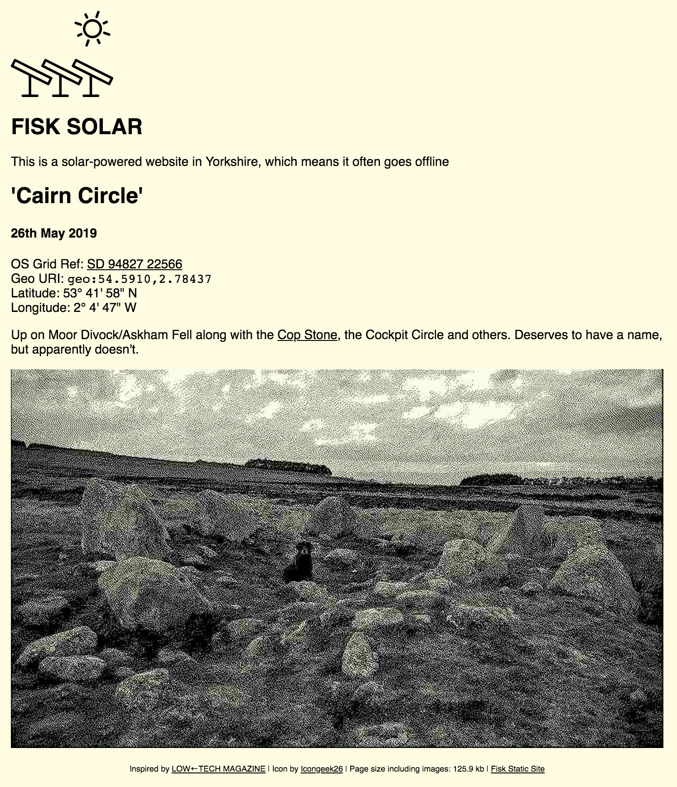

# Statisk

Static site generator heavily inspired by [Low←Tech Magazine](https://solar.lowtechmagazine.com/)

Converts Markdown files to simple Html with support for extreme image size reduction for low-bandwidth web pages.



### Format

`_template.html` should be placed in root directory of the website, simple example:

```html
<!DOCTYPE html>
<html>
    <head>
        <!-- Optional -->
        <title>{{ title }}</title>  
    </head>
    <body>
        {{ content }}
        <footer>
            <!-- Optional -->
            {{ page_size }}
        </footer>
    </body>
</html>
```

A home `index.md` in the root should include `{{ posts }}` where a list of posts will be rendered.

Markdown posts need to be in a Year/Month/Day (`YYYY/MM/DD`) directory structure:
<pre style="font-family: monospace;">
|- _layout.html  
|- index.md
|- 2020/  
    |- 01/ 
        |-20/ 
           |- index.md   
           |- picture.png  
        |-15/ 
           |- index.md
|- 2019/  
    |- 12/    
        |-24/ 
           |- index.md
           |- pictureA.png 
           |- pictureB.png 
</pre> 

## Basic Usage

* `statisk path/to/websiteroot/` - Statisk will iterate over the directories and convert the markdown and images using default settings
* `statisk index.md` - Convert single post and any images, Statisk will look for `_template.html` three directories up in the hierarchy
* `statisk index.md path/to/_a_new_template.html` - Convert single post and images using the supplied template, useful when redesigning a site.
* `statisk -single index.md  -template path/to/_a_new_template.html` - As above but with explicit arguments.

## Image Conversion

The default behaviour is to resize any images larger than 960px to 960px. You can override this with various options:

* `statisk -dir path/to/websiteroot/ -convert_color` - this is the default behaviour, images are resized to max image width (default is 960px)
* `statisk -dir path/to/websiteroot/ -convert_none` - leave all images as they are
* `statisk -dir path/to/websiteroot/ -convert_greyscale` - reduce image filesizes by converting to greyscale and resizing to max image width
* `statisk -dir path/to/websiteroot/ -convert_dither` - use the default monochrome dither algorithm (Atkinson) to drastically reduce image sizes
* `statisk -dir path/to/websiteroot/ -algorithm atkinson` - specify dither algorithm to drastically reduce image sizes (see available options below)
* `statisk -dir path/to/websiteroot/ -convert_dither -threshold 255` - set the the threshold value for dithering, default is 128

The default image file format is .png at max width of 960px, you can specify jpeg and/or custom max width:

* `statisk -dir path/to/websiteroot/ -image_format jpeg_high` - options are `png`, `jpeg` (medium quality: 0.65), `jpeg_low` (0.5), `jpeg_medium`, or `jpeg_high` (0.85) 
* `statisk -dir path/to/websiteroot/ -maxwidth 800`

## Per-File Overrides

You can override any global command-line configuration by adding a hidden comment on the first line of the markdown file, this is just a key value pair in the same way you'd pass on the command-line:

* `<!--- -foreground #ffcdcd -algorithm 5by3Bayer -threshold 100 -->` - this will set the foreground dither for this markdown file only to purple

## Example

* `statisk -dir /Users/pip/pi/fisk_solar_website/ -algorithm 8by8bayer -threshold 255 -image_format png -maxwidth 800`

## Future Plans

* Refactor this sorry mess
* RSS feed

### Links

* https://github.com/lowtechmag/solar/wiki/Solar-Web-Design
* http://nginx.org/en/docs/http/ngx_http_gzip_static_module.html

## Full Syntax

| Argument | Shortcut | Behaviour | Requires Argument |
| --- | --- | --- | --- |
| `-image_format` | `-if` | Override default image format, eg. `-if jpeg_high` | Yes |
| `-maxwidth` | `-mw` | Override default image width, eg. `-mw 800` | Yes |
| `-convert_none` | `-cn` | Leave images untouched | No | 
| `-convert_greyscale` | `-cg` | Images lose colour information, resized to default 960px | No |
| `-convert_color` | `-cc` | Images resized to 960px | No |
| `-convert_dither` | `-cd` | Images resized to 960px and dithered using default Atkinson method | No |
| `-algorithm` | `-al` | Sets dither algorithm, eg. `-al stucki` | Yes |
| `-threshold` | `-th` | Set threshold of dither algorithms, eg. `-th  255` | Yes |
| `-foreground` | `-fg` | Set the colour of dithered images, eg. `-fg #dd0000` | Yes |
| `-dir` | | Set the website root directory | Yes |
| `-single` | | Set a single markdown file to process | Yes |
| `-template` | | Set template html file | Yes |
| `-gzip` | `-gz` | saves a compressed file alongside any html so the server can save some processing ([if supported](http://nginx.org/en/docs/http/ngx_http_gzip_static_module.html)), eg. index.html, index.gz | No |

## File Size Savings

| flags/arguments | index + image size | notes |
| --- | --- | --- |
|  `-convert_none` | 1.7mb | No transform of images |
| `-convert_color` | 819kb | Images resized to default 960px | 
| `-convert_color -maxwidth 680` | 432kb | Images resized to 680px |
| `-convert_greyscale` | 405kb | Images lose colour information, resized to default 960px |
| `-convert_dither` | 36kb | Images resized to 960px and dithered using default Atkinson method |  
| `-algorithm 8by8bayer -threshold 245` | 29kb | As above but using 8x8 Bayer method which has more contiguous blocks |   
| `-algorithm 8by8bayer -threshold 245 -maxwidth 680` | 17kb | As above but resized to 680 first |  
| `-algorithm 8by8bayer -threshold 245 -maxwidth 680 -gzip` | 14kb | As above, but gzip'd (requires server config) | 

## Dithering

Available dithering algorithms (from [DitherKt](https://github.com/fiskurgit/DitherKt)):

2by2Bayer, 3by3Bayer, 4by4Bayer, 5by3Bayer, 8by8Bayer, FloydSteinberg, FalseFloydSteinberg, NewspaperHalftone, JarvisJudiceNinke, Sierra, SierraLite, TwoRowSierra, Burkes, Atkinson, Stucki, ErrorDif, Threshold, Random
