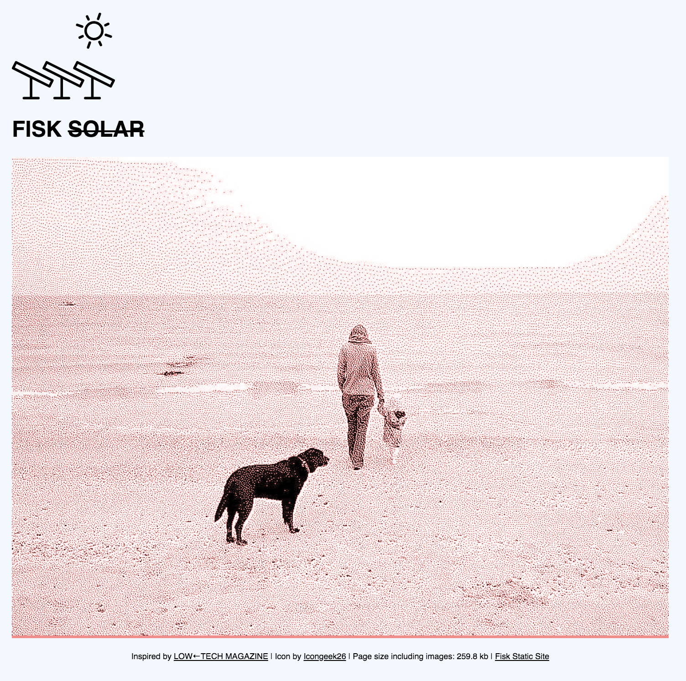

# Statisk

Static site generator heavily inspired by [Low←Tech Magazine](https://solar.lowtechmagazine.com/)

Work in progress/a hacky mess. DO NOT USE.

Converts Markdown files to simple Html with monochrome dithered images creating extremely low-bandwidth web pages.



### Links

* https://github.com/lowtechmag/solar/wiki/Solar-Web-Design

### Format

`_template.html` should be placed in root directory of the website, simple example:

```html
<!DOCTYPE html>
<html>
    <head>
        <!-- Optional -->
        <title>{{ title }}</title>  
    </head>
    <body>
        {{ content }}
        <footer>
            <!-- Optional -->
            {{ page_size }}
        </footer>
    </body>
</html>
```

An `index.md` in the root should include `{{ posts }}` where a list of posts will be rendered.

Markdown posts need to be in a Year/Month/Day (`YYYY/MM/DD`) directory structure:
<pre style="font-family: monospace;">
|-_layout.html  
|- 2020/  
    |- 01/ 
        |-20/ 
           |- index.md   
           |- picture.png  
        |-15/ 
           |- index.md
|- 2019/  
    |- 12/    
        |-24/ 
           |- index.md
           |- pictureA.png 
           |- pictureB.png 
</pre> 

## Usage

* `statisk path/to/websiteroot/` - Statisk will then iterate over the directories and convert the markdown and images
* `statisk index.md` - Convert single post and images, Statisk will look for `_template.html` two directories up in the hierarchy
* `statisk index.md path/to/_a_new_template.html` - Convert single post and images using the supplied template.

## Future Plans

* RSS feed